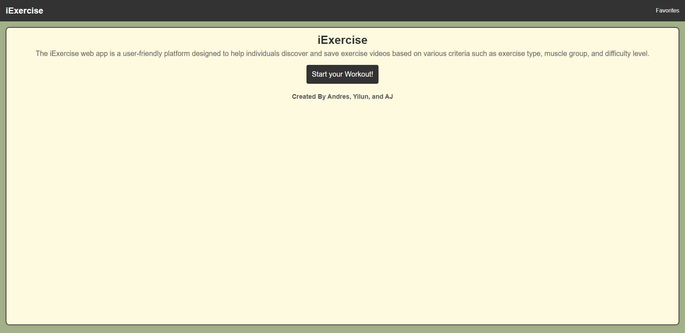
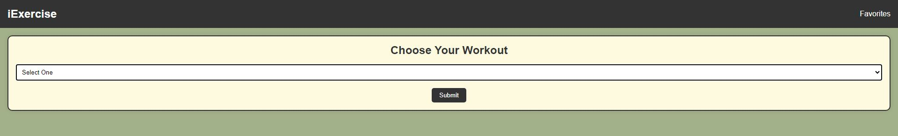
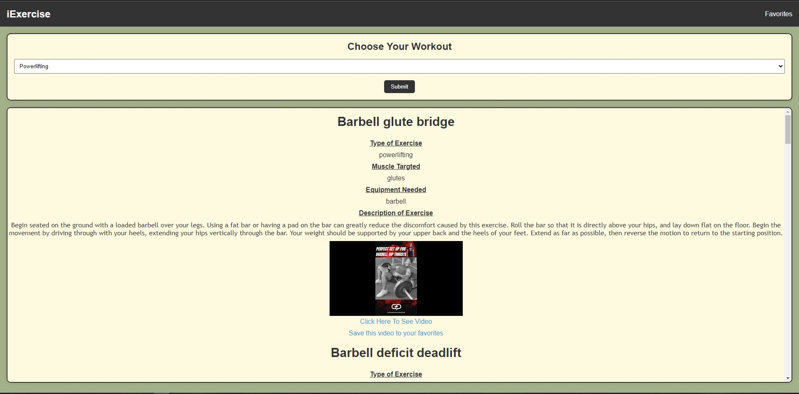
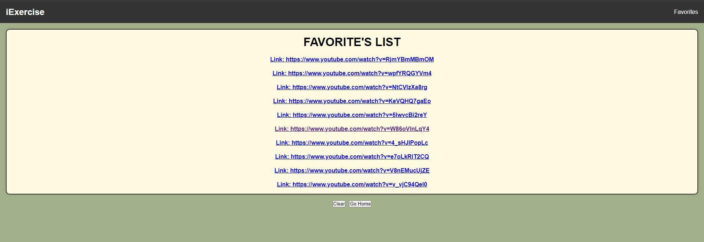

# iExcercise

## Description

Motivation: The motivation behind building iExercise was to create a user-friendly web application that allows users to explore and save exercise videos based on different criteria such as exercise type, muscle group, and difficulty level.

Why: The goal was to provide users with a tool that makes it easy to find workout routines tailored to their preferences and save their favorite exercise videos for quick access.

Problem it Solves: iExercise addresses the challenge of discovering relevant exercise videos by integrating external APIs to fetch exercise information and corresponding YouTube videos. It simplifies the process of finding and saving workout routines.

What I Learned: During the development of iExercise, I gained experience in working with external APIs, managing data dynamically, and enhancing the user experience with interactive features.

## Table of Contents

N/A

## Usage

1.Click the "Start your Workout!" button to access exercise options.

2.Choose the exercise type, muscle group, and difficulty level.

3.Click the "Submit" button to retrieve exercise information and related YouTube videos.

4.For each exercise, click "Click Here To See Video" to watch the associated YouTube video.
5.Click "Save this video to your favorites" to add the video to your favorites list.
6.To view your favorite videos, click on the "Favorites" link in the navigation bar.

## Credits
Contributors:

Andres "Aserrano7" https://github.com/Aserrano7

Yilun "ylf456" https://github.com/ylf456

AJ "lifewawj" https://github.com/lifewawj

Third-party assets:
YouTube API: https://developers.google.com/youtube/v3/getting-started
Exercise API: https://api-ninjas.com/api/exercises

## License

N/A

## Badges

N/A

## Features

Browse exercise options by type, muscle group, and difficulty.
View exercise details, including type, muscle group, equipment needed, and instructions.
Watch related YouTube videos for each exercise.
Save favorite videos for quick access.

## How to Contribute

N/A

## Tests

N/A

## Link(s)

Deployed: https://aserrano7.github.io/iExercise/

GitHub repo:  https://github.com/Aserrano7/iExercise
